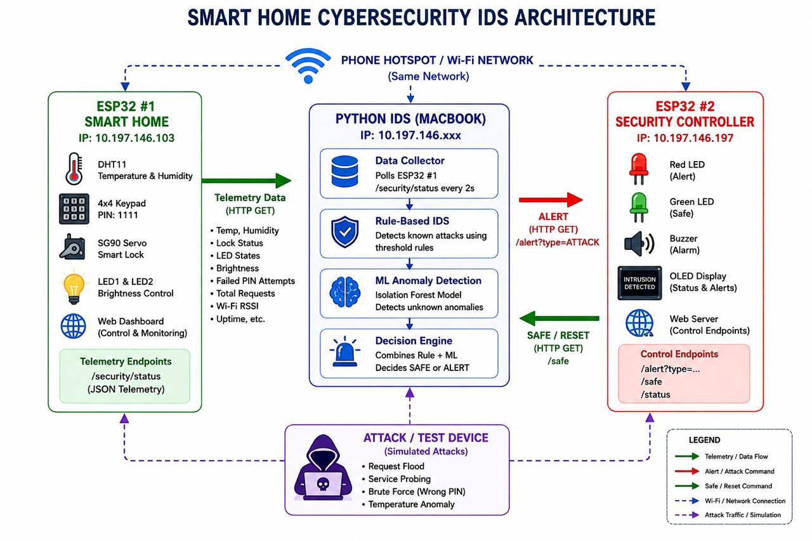

# Smart Home Cybersecurity IDS

An IoT-focused Intrusion Detection System (IDS) designed to monitor, detect, and respond to suspicious activity in a smart home environment.

The project combines ESP32-based IoT devices, a Python-based cybersecurity engine, rule-based detection, machine-learning anomaly detection, and an ESP32 security controller.

---

## System Architecture



---

## Overview

The system consists of three major components:

### 1. ESP32 Smart Home Device

The first ESP32 represents the smart home IoT environment.

It provides:

- DHT11 temperature and humidity monitoring
- 4x4 keypad authentication
- SG90 servo-based smart lock
- LED control
- Brightness control
- Web dashboard
- HTTP telemetry API
- Failed PIN attempt tracking
- Total request monitoring
- Wi-Fi RSSI monitoring
- Device uptime monitoring

Telemetry is exposed through:

```text
GET /security/status
```

Example telemetry includes:

- Temperature
- Humidity
- Lock Status
- LED States
- Brightness
- Failed PIN Attempts
- Total Requests
- Wi-Fi RSSI
- Uptime

---

### 2. Python-Based Intrusion Detection System

The Python application acts as the central cybersecurity engine.

It consists of four major components:

```text
Data Collector
      ↓
Rule-Based IDS
      ↓
ML Anomaly Detection
      ↓
Decision Engine
```

#### Data Collector

The collector periodically polls the smart-home ESP32 for security telemetry.

```text
GET /security/status
```

The collected information is used for both rule-based and machine-learning analysis.

#### Rule-Based IDS

The rule engine detects known attack patterns using predefined thresholds.

Examples include:

- Excessive failed PIN attempts
- Abnormally high request rates
- Request flooding
- Suspicious service activity
- Abnormal sensor values
- Other known threshold-based conditions

#### ML Anomaly Detection

The project uses machine-learning based anomaly detection to identify unusual behavior that may not match predefined rules.

The architecture uses an:

```text
Isolation Forest
```

model for anomaly detection.

This allows the IDS to identify potentially suspicious behavior based on deviations from normal telemetry patterns.

#### Decision Engine

The decision engine combines the outputs of:

```text
Rule-Based Detection
        +
ML Anomaly Detection
        ↓
Final Security Decision
```

The resulting state is classified as:

```text
SAFE
```

or:

```text
ATTACK
```

---

### 3. ESP32 Security Controller

The second ESP32 acts as the physical security response controller.

It provides:

- Red LED for attack alerts
- Green LED for safe state
- Buzzer for alarms
- OLED display for status and alerts
- Web server
- Security control endpoints

The Python IDS communicates with the controller using HTTP requests.

#### Attack Alert

```text
GET /alert?type=ATTACK
```

This activates the security alert state.

#### Safe / Reset

```text
GET /safe
```

This returns the controller to the safe state.

#### Controller Status

```text
GET /status
```

Returns the current security-controller status.

---

# Detection Capabilities

The project supports controlled simulation and detection of several cybersecurity scenarios.

## Request Flooding

Generates a high volume of HTTP requests against the smart-home device.

The IDS monitors request activity and can identify abnormal request rates.

## Service Probing

Simulates attempts to discover or interact with available device services and endpoints.

## Brute-Force Authentication

Simulates repeated incorrect PIN attempts against the smart lock.

The IDS monitors failed authentication attempts and can trigger an alert when configured thresholds are exceeded.

## Temperature Anomaly

Simulates abnormal environmental telemetry.

The machine-learning anomaly detection component can identify unusual sensor behavior.

---

# Hybrid Detection Architecture

The major feature of this project is the combination of traditional rule-based detection with machine-learning anomaly detection.

```text
                 ESP32 #1
              Smart Home Device
                     │
                     │ HTTP Telemetry
                     ▼
             ┌───────────────┐
             │ Data Collector│
             └───────┬───────┘
                     │
             ┌───────┴────────┐
             │                │
             ▼                ▼
      ┌─────────────┐  ┌───────────────┐
      │ Rule-Based  │  │ ML Anomaly     │
      │ IDS         │  │ Detection      │
      └──────┬──────┘  └───────┬───────┘
             │                 │
             └────────┬────────┘
                      ▼
              ┌───────────────┐
              │ Decision      │
              │ Engine        │
              └───────┬───────┘
                      │
                ┌─────┴─────┐
                │           │
                ▼           ▼
              SAFE        ATTACK
                │           │
                └─────┬─────┘
                      ▼
             ESP32 Security
                Controller
```

---

# Technology Stack

## Hardware

- ESP32 development boards
- DHT11 temperature/humidity sensor
- 4x4 matrix keypad
- SG90 servo motor
- LEDs
- Buzzer
- OLED display
- Wi-Fi network

## Software

- C++
- Arduino Framework
- Python 3
- Flask
- Requests
- NumPy
- Pandas
- Scikit-learn
- Joblib
- HTTP/REST

## Machine Learning

The anomaly detection component uses:

```text
Isolation Forest
```

Isolation Forest is suitable for identifying unusual observations in telemetry data without requiring every possible attack to be explicitly labelled.

---

# Project Structure

```text
SmartHomeCyberSecurity/
│
├── README.md
├── LICENSE
├── .gitignore
├── requirements.txt
│
├── docs/
│   ├── architecture.png
│   ├── project-overview.md
│   └── api-endpoints.md
│
├── esp32/
│   ├── smart-home/
│   │   ├── smart-home.ino
│   │   ├── README.md
│   │   └── config.example.h
│   │
│   └── security-controller/
│       ├── security-controller.ino
│       ├── README.md
│       └── config.example.h
│
├── ids/
│   ├── __init__.py
│   ├── main.py
│   ├── collector.py
│   ├── rule_engine.py
│   ├── anomaly_detector.py
│   ├── decision_engine.py
│   └── config.py
│
├── attack_simulation/
│   ├── request_flood.py
│   ├── service_probing.py
│   ├── brute_force_simulation.py
│   ├── temperature_anomaly.py
│   └── README.md
│
├── model/
│   ├── train.py
│   ├── predict.py
│   └── README.md
│
├── dashboard/
│   └── README.md
│
├── logs/
│   └── .gitkeep
│
└── tests/
    ├── test_rules.py
    ├── test_anomaly_detection.py
    └── test_api.py
```

---

# Data Flow

The overall system operates as follows:

```text
┌─────────────────────┐
│ ESP32 #1            │
│ Smart Home          │
│                     │
│ Sensors             │
│ Keypad              │
│ Smart Lock          │
│ LEDs                │
│ Web Dashboard       │
└──────────┬──────────┘
           │
           │ HTTP GET
           │ /security/status
           ▼
┌────────────────────────────┐
│ Python IDS                 │
│                            │
│ Data Collector             │
│        ↓                   │
│ Rule-Based IDS             │
│        ↓                   │
│ ML Anomaly Detection       │
│        ↓                   │
│ Decision Engine            │
└──────────┬─────────────────┘
           │
           │ HTTP command
           ▼
┌────────────────────────────┐
│ ESP32 #2                   │
│ Security Controller        │
│                            │
│ Red LED                    │
│ Green LED                  │
│ Buzzer                     │
│ OLED Display               │
└────────────────────────────┘
```

---

# Network Architecture

All components communicate over the same local Wi-Fi network.

```text
                  Wi-Fi Network
                       │
        ┌──────────────┼──────────────┐
        │              │              │
        ▼              ▼              ▼
   ESP32 #1        Mac / Python    ESP32 #2
 Smart Home            IDS        Security Controller
```

The actual IP addresses should be configured locally rather than committed as credentials or environment-specific configuration.

Example:

```text
ESP32_SMART_HOME_IP=<ESP32_IP>
ESP32_SECURITY_CONTROLLER_IP=<CONTROLLER_IP>
IDS_HOST_IP=<IDS_IP>
```

---

# API Endpoints

## ESP32 Smart Home

### Security Telemetry

```http
GET /security/status
```

Returns security and device telemetry.

Typical information:

```text
Temperature
Humidity
Lock Status
LED State
Brightness
Failed PIN Attempts
Total Requests
Wi-Fi RSSI
Uptime
```

---

## ESP32 Security Controller

### Trigger Attack Alert

```http
GET /alert?type=ATTACK
```

Activates the attack state.

Expected response:

```text
Red LED → ON
Green LED → OFF
Buzzer → ON
OLED → ATTACK / INTRUSION DETECTED
```

### Return to Safe State

```http
GET /safe
```

Expected response:

```text
Red LED → OFF
Green LED → ON
Buzzer → OFF
OLED → SAFE
```

### Security Controller Status

```http
GET /status
```

Returns the current security-controller state.

---

# Attack / Test Device

The project includes controlled attack simulations designed to test the IDS in an authorized lab environment.

Available simulations include:

```text
Request Flooding
Service Probing
Brute-Force Authentication
Temperature Anomaly
```

The attack simulations are intended for the project's own ESP32 devices and local test environment.

They should not be used against systems without authorization.

---

# Installation

## 1. Clone the Repository

```bash
git clone <REPOSITORY_URL>
cd SmartHomeCyberSecurity
```

## 2. Create Python Virtual Environment

```bash
python3 -m venv .venv
```

Activate it on macOS/Linux:

```bash
source .venv/bin/activate
```

On Windows:

```powershell
.venv\Scripts\activate
```

## 3. Install Python Dependencies

```bash
pip install -r requirements.txt
```

---

# Configuration

Network-specific configuration should not be committed directly to the repository.

Use environment variables or a local configuration file.

Example:

```text
ESP32_SMART_HOME_IP=<ESP32_SMART_HOME_IP>
ESP32_SECURITY_CONTROLLER_IP=<ESP32_SECURITY_CONTROLLER_IP>
```

If using a `.env` file:

```text
ESP32_SMART_HOME_IP=10.x.x.x
ESP32_SECURITY_CONTROLLER_IP=10.x.x.x
```

The `.env` file should remain untracked.

---

# Running the IDS

After activating the virtual environment:

```bash
python ids/main.py
```

The IDS should:

1. Connect to the smart-home ESP32.
2. Collect telemetry.
3. Evaluate rule-based security conditions.
4. Run ML anomaly detection.
5. Pass results to the decision engine.
6. Determine the security state.
7. Notify the security controller when required.

---

# Machine Learning Model

The anomaly detection component uses an Isolation Forest model.

Typical workflow:

```text
Telemetry
    ↓
Feature Extraction
    ↓
Data Preprocessing
    ↓
Isolation Forest
    ↓
Anomaly Score
    ↓
Decision Engine
```

The model can be trained using normal telemetry and then used to identify observations that deviate significantly from learned normal behaviour.

---

# Logging

Runtime logs are stored locally.

The repository intentionally does not track generated log files.

The `logs` directory contains:

```text
logs/.gitkeep
```

This preserves the directory structure while preventing potentially sensitive runtime data from being committed.

---

# Testing

Tests are maintained under:

```text
tests/
```

Run the test suite using:

```bash
pytest
```

Individual tests can also be executed using:

```bash
pytest tests/test_rules.py
```

---

# Security Considerations

This project is intended for:

- Academic projects
- Cybersecurity research
- IoT security experimentation
- Controlled laboratory environments
- Demonstration of IDS concepts

Do not deploy the attack simulation components against systems for which you do not have authorization.

Network credentials, API keys, private keys, and other secrets must never be committed to the repository.

---

# Future Improvements

Potential future improvements include:

- Real-time security dashboard
- Historical telemetry database
- Advanced attack classification
- Multiple machine-learning models
- Automated model retraining
- Improved anomaly scoring
- Device authentication
- HTTPS/TLS communication
- API authentication
- Role-based access control
- Persistent alert history
- Email or mobile notifications
- Additional IoT attack simulations
- Performance benchmarking
- False-positive and false-negative analysis
- Detection accuracy evaluation

---

# Project Objectives

The primary objectives of the project are:

1. Build a practical IoT cybersecurity monitoring system.
2. Collect real-time telemetry from an ESP32 smart-home device.
3. Detect known attack patterns using security rules.
4. Detect previously unknown anomalies using machine learning.
5. Combine multiple detection mechanisms.
6. Automatically respond to detected security events.
7. Provide a physical security response through an ESP32 controller.
8. Demonstrate intrusion detection concepts in a smart-home environment.

---

# Author

## Smart Home Cybersecurity IDS

An IoT cybersecurity project combining:

```text
ESP32
+
Python
+
Rule-Based IDS
+
Machine Learning
+
Automated Security Response
```

---

# License

This project is intended for educational and research purposes.
